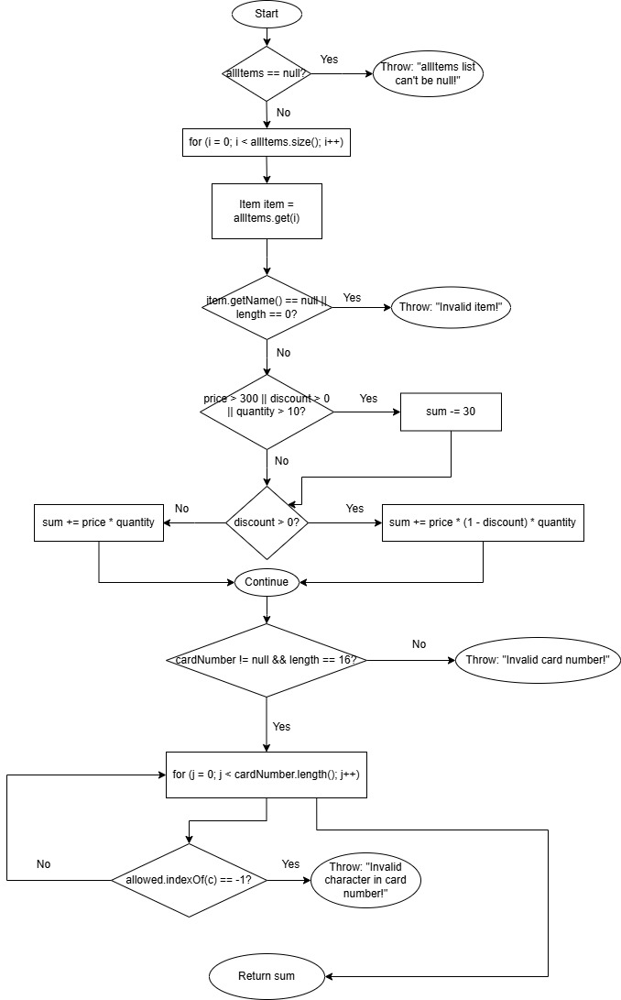

# SI_2025_lab2_193284
Јана Трпковска 193284

## 2. Control Flow Graph (CFG)
На сликата е прикажан CFG за функцијата `checkCart` : 

## 3. Цикломатска комплексност
Формула:
M = E - N + 2P или M = D + 1, D = бр. на услови

Во `checkCart` има 8 услови.
2 for loops, 6 if-услови = D

М = 8+1 = 9

Потребни се минимум 9 независни тест патеки за да се покрие целата логика на функцијата.